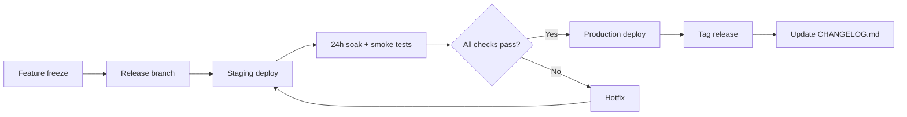

# Engineering Standards

> **Phase:** 3.5 — Engineering Governance
> **Status:** Approved
> **Version:** 1.0.0
> **Last Updated:** 2026-07-10

## 1. Overview

This document defines the engineering standards for the SchemaIntern platform. All code, infrastructure, documentation, and processes must conform to these standards unless explicitly exempted by an Architecture Decision Record (ADR).

These standards apply to all 10 engineers and AI agents working on the platform. They are designed to be followed without requiring architect consultation.

---

## 2. Folder Structure

### 2.1 Repository Layout

```
schemaintern/
├── .github/
│   ├── workflows/          # CI/CD pipeline definitions
│   ├── CODEOWNERS          # Ownership assignments
│   └── PULL_REQUEST_TEMPLATE.md
├── docs/
│   ├── specifications/     # All Phase 3.5 spec documents
│   ├── epics/              # EP-001 through EP-017
│   ├── agents/             # Agent workspace definitions
│   ├── tasks/              # TASK-001 through TASK-135
│   ├── templates/          # Task, ADR, bug, feature templates
│   ├── decisions/          # ADR-001 through ADR-012+
│   └── research/           # Research spike outputs
├── src/
│   ├── backend/
│   │   ├── public-api/           # FastAPI public API service
│   │   ├── ke-api/               # Knowledge Engine API
│   │   ├── query-pipeline/       # NL2SQL pipeline (agents)
│   │   ├── schema-intel/         # Schema intelligence workers
│   │   ├── learning-loop/        # Self-learning workers
│   │   ├── auth/                 # Authentication service
│   │   └── lib/                  # Shared libraries
│   │       ├── models/           # Pydantic models
│   │       ├── middleware/       # FastAPI middleware
│   │       ├── db/               # Database abstractions
│   │       ├── llm/              # LLM client abstractions
│   │       └── utils/            # Utility functions
│   ├── frontend/
│   │   ├── app/                  # Next.js App Router pages
│   │   ├── components/           # React components
│   │   │   ├── ui/               # Base UI (shadcn)
│   │   │   ├── layout/          # Layout components
│   │   │   ├── query/           # Query-related components
│   │   │   ├── schema/          # Schema browser components
│   │   │   ├── settings/        # Settings components
│   │   │   └── admin/           # Admin components
│   │   ├── lib/                  # Shared utilities
│   │   ├── stores/              # Zustand stores
│   │   ├── hooks/               # Custom React hooks
│   │   ├── types/               # TypeScript type definitions
│   │   └── styles/              # Global styles
│   ├── infrastructure/
│   │   ├── terraform/           # Terraform modules
│   │   ├── kubernetes/          # K8s manifests
│   │   ├── helm/                # Helm charts
│   │   └── scripts/            # Infrastructure scripts
│   └── shared/
│       ├── proto/                # Protocol Buffers
│       ├── openapi/              # OpenAPI specs
│       └── types/                # Shared type definitions
├── tests/
│   ├── unit/                    # Unit tests
│   ├── integration/             # Integration tests
│   ├── e2e/                     # End-to-end tests
│   ├── load/                    # Load test scripts
│   │   ├── k6/
│   │   ├── locust/
│   │   ├── ghz/
│   │   └── query-replay/
│   └── fixtures/                # Test data and mocks
├── scripts/
│   ├── build/                   # Build scripts
│   ├── deploy/                  # Deployment scripts
│   └── dev/                     # Developer tooling
├── .github/
├── .vscode/                     # Shared VS Code settings
├── docker-compose.yml           # Local development
├── Makefile                     # Common commands
├── pyproject.toml               # Python project config
├── package.json                 # Frontend dependencies
├── tsconfig.json                # TypeScript config
├── .pre-commit-config.yaml      # Pre-commit hooks
├── .editorconfig                # Editor settings
├── .gitignore
├── .prettierrc                  # Prettier config
├── .eslintrc.js                 # ESLint config
├── .env.example                 # Environment variables
├── README.md                    # Project overview
└── AGENTS.md                    # Agent instructions
```

### 2.2 Service Per Directory

Each backend service MUST live in its own directory under `src/backend/` with:

```
<service-name>/
├── __init__.py
├── main.py              # FastAPI application entrypoint
├── api/                 # Route handlers
│   ├── __init__.py
│   ├── routes.py
│   └── dependencies.py
├── core/                # Business logic
│   ├── __init__.py
│   └── <logic>.py
├── models/              # Pydantic request/response models
│   ├── __init__.py
│   └── <model>.py
├── services/            # External service clients
│   ├── __init__.py
│   └── <client>.py
├── config.py            # Service configuration
└── tests/               # Service-specific tests
    ├── __init__.py
    └── test_<name>.py
```

### 2.3 Naming Rules for Files and Directories

| Entity | Convention | Example |
|--------|-----------|---------|
| Python files | snake_case | `query_service.py` |
| TypeScript files | camelCase | `queryStore.ts` |
| React components | PascalCase | `QueryEditor.tsx` |
| Test files | `test_<name>.py` / `<name>.test.ts` | `test_router.py`, `QueryEditor.test.tsx` |
| Directories | kebab-case | `query-pipeline/` |
| Terraform modules | snake_case | `eks_cluster/` |
| K8s manifests | kebab-case | `api-deployment.yaml` |

---

## 3. Coding Standards

### 3.1 Language-Specific Standards

#### Python (Backend)

| Rule | Standard | Rationale |
|------|----------|-----------|
| Version | Python 3.12+ | Latest stable with performance improvements |
| Type hints | Required on all function signatures | IDE support, static analysis |
| Docstrings | Google style, required for public APIs | Sphinx auto-doc |
| Async | Use asyncio + httpx for I/O | Non-blocking by default |
| Pydantic | v2 for all models | Validation, serialization, OpenAPI |
| SQLAlchemy | 2.0 style (async) | ORM with async support |
| FastAPI | Latest, dependency injection pattern | Performance, auto-docs |
| Exception handling | Custom exceptions, global handler | Consistent error responses |
| Logging | structlog (structured) | JSON logs for Loki |
| Configuration | pydantic-settings | Type-safe config, .env |

#### TypeScript/React (Frontend)

| Rule | Standard | Rationale |
|------|----------|-----------|
| Version | TypeScript 5.5+ | Latest features |
| Strict mode | `strict: true` in tsconfig | Type safety |
| React | 19, functional components + hooks | Modern React |
| Next.js | 15, App Router | Server components, streaming |
| State management | Zustand for global, React Query for server | Minimal boilerplate |
| Styling | Tailwind CSS + shadcn/ui | Consistent design system |
| Accessibility | WCAG 2.2 AA minimum | Legal compliance |
| Error boundaries | One per route segment | Graceful degradation |
| Bundle size | Dynamic imports for heavy components | Performance |
| Package manager | pnpm | Faster, stricter |

### 3.2 General Standards

| Rule | Standard |
|------|----------|
| No commented-out code | Delete it. Git history exists for a reason. |
| No magic strings/numbers | Use named constants or enums |
| No `print()` statements | Use proper logging |
| No `except: pass` | Always handle or re-raise with context |
| No wildcard imports | Explicit imports only |
| Maximum function length | 60 lines (excluding docstring) |
| Maximum file length | 400 lines (exceptions allowed with ADR) |
| Maximum cyclomatic complexity | 10 per function |
| Maximum nesting depth | 4 levels |
| Single responsibility | One class = one concern |

---

## 4. Naming Conventions

### 4.1 Python

| Element | Convention | Example |
|---------|-----------|---------|
| Modules | snake_case | `schema_sync.py` |
| Classes | PascalCase | `SchemaSynchronizer` |
| Functions/Methods | snake_case | `sync_schema()` |
| Variables | snake_case | `table_count` |
| Constants | UPPER_SNAKE_CASE | `MAX_TABLE_DEPTH` |
| Private | Leading underscore | `_internal_helper()` |
| Very private | Double underscore | `__cache()` |
| Type variables | PascalCase | `T`, `ResultT` |
| Async functions | `async def` prefix | `async def fetch_schema()` |

### 4.2 TypeScript

| Element | Convention | Example |
|---------|-----------|---------|
| Components | PascalCase | `QueryEditor` |
| Hooks | `use` prefix + camelCase | `useQueryHistory` |
| Stores | camelCase | `queryStore` |
| Functions | camelCase | `formatQuery` |
| Variables | camelCase | `selectedTable` |
| Constants | UPPER_SNAKE_CASE | `MAX_RESULTS` |
| Types/Interfaces | PascalCase | `QueryResult` |
| Enums | PascalCase | `QueryStatus` |
| Enum members | PascalCase | `QueryStatus.Running` |
| Private | `#` prefix (ES2022) | `#cache` |

### 4.3 Infrastructure

| Element | Convention | Example |
|---------|-----------|---------|
| Terraform modules | snake_case | `eks_cluster` |
| Terraform variables | snake_case | `cluster_name` |
| K8s resources | kebab-case | `api-deployment` |
| K8s labels | kebab-case | `app.kubernetes.io/name` |
| Helm values | camelCase | `replicaCount` |
| Docker images | kebab-case | `schemaintern/public-api` |
| CI/CD jobs | kebab-case | `deploy-production` |
| Environment variables | UPPER_SNAKE_CASE | `DATABASE_URL` |

---

## 5. Git Workflow

### 5.1 Commit Style

- **Format:** `<type>(<scope>): <imperative description>`
- **Types:** `feat`, `fix`, `refactor`, `test`, `docs`, `style`, `chore`, `perf`, `ci`, `build`
- **Scope:** Service or component name (e.g., `public-api`, `ke-api`, `frontend`, `infra`)
- **Body:** Optional, explain *why* not *what*
- **Footer:** Optional, references (e.g., `Closes EP-007`)
- **No WIP commits on main branches**

```
feat(public-api): add rate limiting middleware

Implement token bucket algorithm with Redis backend.
Closes EP-005-TASK-023
```

### 5.2 Commit Rules

| Rule | Standard |
|------|----------|
| Atomicity | One commit = one logical change |
| Message length | Subject ≤ 72 chars, body wrap at 80 chars |
| Signed-off | Not required |
| Co-authors | GitHub Co-authored-by trailer for pair programming |
| Merge commits | Squash merge into `main` |
| Rebasing | Allowed on feature branches, never on shared branches |

### 5.3 Branch Naming

| Branch Type | Pattern | Example |
|-------------|---------|---------|
| Feature | `feat/<epic>-<short-description>` | `feat/EP-005-rate-limiting` |
| Bug fix | `fix/<short-description>` | `fix/connection-pool-leak` |
| Refactor | `refactor/<short-description>` | `refactor/query-pipeline` |
| Performance | `perf/<short-description>` | `perf/cache-eviction` |
| Documentation | `docs/<short-description>` | `docs/api-usage-examples` |
| CI/CD | `ci/<short-description>` | `ci/upgrade-actions-version` |
| Release | `release/v<major>.<minor>.<patch>` | `release/v1.2.0` |
| Hotfix | `hotfix/<short-description>` | `hotfix/auth-bypass` |

---

## 6. Branching Strategy

### 6.1 Trunk-Based Development with Short-Lived Branches

```
main (production-ready)
  └── feat/EP-005-rate-limiting (created from main)
       └── squash merge back to main
```

### 6.2 Rules

| Rule | Standard |
|------|----------|
| Branch lifetime | ≤ 2 days |
| Branch age limit | Force delete after 5 days of inactivity |
| Branch source | Always from `main` |
| Merge target | Always `main` (no intermediate branches) |
| Merge method | Squash merge |
| Number of commits | Unlimited (squashed on merge) |
| Conflicts | Rebase onto `main`, resolve locally |
| Protected branches | `main`, `release/*` |
| Pre-merge checks | CI must pass, PR must be approved, no merge conflicts |

### 6.3 Hotfix Flow

```
main (v1.0.0)
  └── hotfix/auth-bypass (from v1.0.0 tag)
       ├── Fix applied
       ├── Tag v1.0.1
       └── Merge back to main
```

---

## 7. PR Reviews

### 7.1 PR Template

Every PR must use the template at `.github/PULL_REQUEST_TEMPLATE.md`:

```markdown
## Description
<!-- What does this PR do? Why? -->

## Type of Change
- [ ] feat: New feature
- [ ] fix: Bug fix
- [ ] refactor: Code restructuring
- [ ] perf: Performance improvement
- [ ] test: Test addition/update
- [ ] docs: Documentation
- [ ] ci: CI/CD changes
- [ ] chore: Maintenance

## Related Issues
<!-- EP-###, TASK-###, or ADR-### -->

## Testing
- [ ] Unit tests pass
- [ ] Integration tests pass
- [ ] Manual testing completed

## Checklist
- [ ] Code follows coding standards
- [ ] No new warnings/linting errors
- [ ] Tests added for new code
- [ ] Documentation updated
- [ ] Breaking changes documented in ADR
```

### 7.2 Review Rules

| Rule | Standard |
|------|----------|
| Minimum reviewers | 1 for feat/fix, 2 for refactor/infra |
| Review SLA | < 4 hours during working hours |
| Max lines per PR | 400 lines (exceptions: generated code, config files) |
| Self-review | Run through checklist before requesting review |
| Changes requested | Fix all before re-requesting |
| Dismiss stale approvals | Yes, after force push |
| PR author merges | After CI passes and approvals received |

### 7.3 Review Criteria

Reviewers MUST check:

1. **Correctness:** Does the code do what it claims?
2. **Test coverage:** Are edge cases covered?
3. **Security:** Any injection vectors, missing auth, data leaks?
4. **Performance:** Any N+1 queries, unbounded loops, excessive allocations?
5. **Observability:** Are errors logged? Are metrics emitted?
6. **Consistency:** Follows naming conventions and patterns?
7. **Documentation:** Are public APIs documented? Are changes reflected in specs?
8. **Backward compatibility:** Does this break anything? If yes, is there an ADR?

---

## 8. Testing Standards

### 8.1 Test Pyramid

```
    /\
   / E2E \      < 10% of tests, critical user journeys
  /--------\
 / Integration \   < 30% of tests, service boundaries
/--------------\
/   Unit Tests   \  > 60% of tests, business logic
/------------------\
```

### 8.2 Testing Requirements

| Level | Requirements | Framework | Coverage Target |
|-------|-------------|-----------|----------------|
| Unit (Python) | Test all business logic, edge cases, error paths | pytest | > 85% line coverage |
| Unit (TS) | Test all hooks, stores, utils | vitest + testing-library | > 80% line coverage |
| Integration | Test API routes with test DB, test KE client | pytest + httpx + testcontainers | > 70% path coverage |
| E2E | Test critical user journeys (login, query, settings) | Playwright | All journeys covered |
| Load | Test at 2x expected peak load | k6 + Locust | Pass success criteria |
| Security | Dependency scanning, SAST, DAST | Trivy + Semgrep + OWASP ZAP | No critical/high findings |

### 8.3 Test Naming and Structure

```python
# Python: Given-When-Then pattern
async def test_given_valid_query_when_executed_then_returns_results():
    ...

async def test_given_empty_schema_when_sync_triggered_then_returns_200():
    ...

async def test_given_rate_limit_exceeded_when_request_made_then_returns_429():
    ...
```

```typescript
// TypeScript: describe/it blocks
describe('QueryStore', () => {
    it('should execute a simple query and update state', async () => { ... });
    it('should handle API error and set error state', async () => { ... });
    it('should cancel in-flight query on unmount', async () => { ... });
});
```

### 8.4 Testing Rules

| Rule | Standard |
|------|----------|
| No test = no merge | Every PR must include tests for new code |
| No mocking external APIs | Use testcontainers or WireMock |
| No sleeping in tests | Use `await asyncio.wait_for()` or polling |
| Test data | Use factories (factory_boy for Python, @jackfranklin/factories for TS) |
| Fixtures | Shared fixtures in `tests/fixtures/`, scoped per module |
| Flaky tests | Tag with `@pytest.mark.flaky`, auto-retry 3x, file issue if persistent |
| CI test timeout | 10 minutes for unit, 20 minutes for integration |

---

## 9. CI Rules

### 9.1 Required CI Checks

Every PR must pass these checks before merging:

| Check | Tool | Trigger |
|-------|------|---------|
| Lint (Python) | ruff | On every push |
| Lint (TS) | eslint + prettier | On every push |
| Type check (Python) | mypy (strict mode) | On every push |
| Type check (TS) | tsc --noEmit | On every push |
| Unit tests (Python) | pytest | On every push |
| Unit tests (TS) | vitest | On every push |
| Integration tests | pytest + testcontainers | On PR open, push to branch |
| Build (Docker) | docker build | On PR open (cache layer check) |
| Vulnerability scan | trivy | On PR open, daily on main |
| SAST | semgrep | On PR open |
| Security scan | pip-audit / npm audit | On PR open |
| License check | FOSSA or equivalent | On PR open |
| CodeQL | GitHub CodeQL | On PR open, daily on main |
| Load test | k6 smoke test | On PR open (10s sanity check) |

### 9.2 Pipeline Structure

```yaml
# .github/workflows/pr-check.yml (simplified)
name: PR Check
on: pull_request

jobs:
  lint:
    runs-on: ubuntu-latest
    steps:
      - uses: actions/checkout@v4
      - run: make lint

  type-check:
    runs-on: ubuntu-latest
    steps:
      - uses: actions/checkout@v4
      - run: make typecheck

  unit-tests:
    runs-on: ubuntu-latest
    strategy:
      matrix:
        service: [public-api, ke-api, query-pipeline, frontend]
    steps:
      - uses: actions/checkout@v4
      - run: make test-${{ matrix.service }}

  integration-tests:
    runs-on: ubuntu-latest
    steps:
      - uses: actions/checkout@v4
      - run: make test-integration
```

### 9.3 CI Performance Rules

| Rule | Standard |
|------|----------|
| Pipeline timeout | 15 minutes total |
| Parallel jobs | Lint + type-check first, then tests in parallel |
| Caching | pip/uv cache, pnpm store, Docker layer cache |
| Flaky test retries | 3 retries max, auto-fail after |
| Skipping CI | `[skip ci]` in commit message allowed for docs-only |
| Artifact retention | 7 days for PR artifacts, 30 days for main |

---

## 10. Documentation Standards

### 10.1 Required Documentation

| Document | Location | Maintainer | Update Trigger |
|----------|----------|-----------|---------------|
| README.md | Repo root | Tech lead | Major release |
| AGENTS.md | Repo root | Tech lead | Agent workspace changes |
| API docs | Auto-generated (FastAPI/OpenAPI) | Backend team | API changes |
| Architecture docs | /docs/specifications/ | Architect | ADR approval |
| Epic definitions | /docs/epics/ | Product manager | Sprint planning |
| ADRs | /docs/decisions/ | Author | When decision is made |
| Runbooks | /docs/runbooks/ | SRE team | Incident post-mortem |
| Onboarding | /docs/onboarding/ | Tech lead | Quarter |
| CHANGELOG.md | Repo root | Anyone (in PR) | Every release |

### 10.2 Documentation Rules

| Rule | Standard |
|------|----------|
| Language | English only |
| Format | Markdown (GFM) |
| Line length | 120 characters max |
| Code examples | Use fenced code blocks with language tag |
| Diagrams | Mermaid for sequence, architecture, flow diagrams |
| Links | Relative paths within repo, absolute URLs for external |
| Updates | Every PR that changes behavior MUST update relevant docs |
| Auto-generation | OpenAPI docs auto-generated, not hand-written |

### 10.3 ADR Format

Architecture Decision Records follow the format at `/docs/templates/adr-template.md`:

```markdown
# ADR-###: Title

- **Status:** [Proposed | Accepted | Deprecated | Superseded]
- **Date:** YYYY-MM-DD
- **Author:** @github_handle

## Context
<!-- Why is this decision needed? What problem does it solve? -->

## Decision
<!-- What is the decision? Be specific. -->

## Consequences
<!-- What trade-offs, risks, and benefits does this decision introduce? -->

## Alternatives Considered
<!-- What other options were evaluated, and why were they rejected? -->
```

---

## 11. Code Ownership

### 11.1 CODEOWNERS

Defined in `.github/CODEOWNERS`:

```
# Default
* @schemaintern/tech-leads

# Backend
/src/backend/public-api/ @schemaintern/backend-team
/src/backend/ke-api/ @schemaintern/backend-team
/src/backend/query-pipeline/ @schemaintern/ml-team
/src/backend/schema-intel/ @schemaintern/ml-team
/src/backend/learning-loop/ @schemaintern/ml-team
/src/backend/auth/ @schemaintern/security-team

# Frontend
/src/frontend/ @schemaintern/frontend-team

# Infrastructure
/src/infrastructure/ @schemaintern/infra-team

# Documentation
/docs/ @schemaintern/tech-leads
/docs/specifications/ @schemaintern/architect
/docs/decisions/ @schemaintern/architect

# CI/CD
/.github/workflows/ @schemaintern/infra-team
```

### 11.2 Ownership Responsibilities

| Role | Responsibilities |
|------|----------------|
| Primary owner | Reviews all PRs, maintains quality, mentors contributors |
| Secondary owner | Reviews when primary is unavailable, contributes regularly |
| Tech lead | Architecture decisions, cross-cutting concerns, standards enforcement |
| Security team | All authentication, authorization, encryption, audit code |

### 11.3 Ownership Rules

| Rule | Standard |
|------|----------|
| Every file has an owner | Default to tech-leads if no specific owner |
| Owner must approve | PRs touching owned code need owner or delegate approval |
| Owner is accountable | Not responsible for writing all code, but for quality |
| Ownership can overlap | Shared ownership for cross-cutting concerns |
| Ownership review | Quarterly review to update as team changes |

---

## 12. Linting

### 12.1 Python Linting

| Tool | Purpose | Configuration |
|------|---------|-------------|
| ruff | Linting + formatting | pyproject.toml |
| mypy | Static type checking | pyproject.toml, strict mode |

```toml
# pyproject.toml (relevant sections)
[tool.ruff]
line-length = 100
target-version = "py312"
select = ["ALL"]
ignore = [
    "D203",  # Conflicts with D211 (one-blank-line-before-class)
    "D213",  # Conflicts with D212 (multi-line-summary-first-line)
    "ANN101", # Self not documented
    "ANN102", # Cls not documented
]
fix = true

[tool.ruff.format]
quote-style = "double"

[tool.ruff.lint.pydocstyle]
convention = "google"

[tool.mypy]
strict = true
python_version = "3.12"
disallow_untyped_defs = true
no_implicit_optional = true
warn_return_any = true
warn_unused_ignores = true
exclude = ["tests/", "migrations/"]
```

### 12.2 TypeScript Linting

| Tool | Purpose | Configuration |
|------|---------|-------------|
| eslint | Linting | eslint.config.js |
| prettier | Formatting | .prettierrc |
| tsc | Type checking | tsconfig.json |

```javascript
// eslint.config.js (simplified)
export default [
    { rules: {
        "@typescript-eslint/no-explicit-any": "error",
        "@typescript-eslint/strict-boolean-expressions": "error",
        "no-console": "error",
        "react-hooks/exhaustive-deps": "warn",
    }},
];
```

```json
// .prettierrc
{
    "semi": true,
    "singleQuote": true,
    "trailingComma": "all",
    "printWidth": 100,
    "tabWidth": 2
}
```

### 12.3 Infrastructure Linting

| Tool | Purpose | Configuration |
|------|---------|-------------|
| tflint | Terraform linting | .tflint.hcl |
| checkov | IaC security scanning | checkov config |
| kubeconform | K8s manifest validation | CI job |
| helm lint | Helm chart validation | CI job |

---

## 13. Formatting

### 13.1 Auto-Formatting Rules

| Language | Tool | Run On |
|----------|------|--------|
| Python | ruff format | pre-commit, CI |
| TypeScript | prettier | pre-commit, CI |
| YAML | prettier | pre-commit, CI |
| Markdown | prettier | pre-commit, CI |
| Terraform | terraform fmt | pre-commit, CI |
| Dockerfile | hadolint | CI |
| Shell scripts | shellcheck + shfmt | pre-commit, CI |

### 13.2 Pre-Commit Hooks

```yaml
# .pre-commit-config.yaml
repos:
  - repo: https://github.com/astral-sh/ruff-pre-commit
    rev: v0.6.0
    hooks:
      - id: ruff
        args: [--fix]
      - id: ruff-format
  - repo: https://github.com/pre-commit/mirrors-prettier
    rev: v3.1.0
    hooks:
      - id: prettier
  - repo: https://github.com/pre-commit/pre-commit-hooks
    rev: v4.6.0
    hooks:
      - id: trailing-whitespace
      - id: end-of-file-fixer
      - id: check-yaml
      - id: check-added-large-files
        args: [--maxkb=500]
      - id: detect-private-key
  - repo: https://github.com/antonbabenko/pre-commit-terraform
    rev: v1.92.0
    hooks:
      - id: terraform_fmt
      - id: terraform_tflint
```

### 13.3 Formatter Settings

| Setting | Python | TypeScript | YAML | Markdown | Terraform |
|---------|--------|-----------|------|----------|----------|
| Indent | 4 spaces | 2 spaces | 2 spaces | 2 spaces | 2 spaces |
| Line length | 100 | 100 | 120 | 120 | 100 |
| Quotes | Double | Single | N/A | N/A | Double |
| Trailing comma | Always | Always | N/A | N/A | N/A |
| Semicolons | N/A | Always | N/A | N/A | N/A |

---

## 14. Dependency Management

### 14.1 Python Dependencies

| Rule | Standard |
|------|----------|
| Package manager | uv (preferred) or pip-tools |
| Dependency file | `pyproject.toml` (single source of truth) |
| Lock file | `uv.lock` (checked into repo) |
| Production deps | `[project.dependencies]` |
| Dev deps | `[project.optional-dependencies.dev]` |
| Version pinning | Upper bound only: `fastapi>=0.110.0,<1.0.0` |
| Update cadence | Weekly automated (Dependabot) |
| Security patches | Auto-merge for patch versions |
| Deprecation | 3-month warning before removing any dependency |
| New dependencies | Must be approved in PR, no GPL/AGPL licenses |
| Transitive deps | `uv pip compile` resolves all, checked in CI |

### 14.2 TypeScript Dependencies

| Rule | Standard |
|------|----------|
| Package manager | pnpm |
| Lock file | `pnpm-lock.yaml` (checked into repo) |
| Version pinning | Exact versions in `package.json` |
| Update cadence | Weekly automated (Renovate) |
| Security patches | Auto-merge for patch versions |
| Bundle analysis | `pnpm build --analyze` for significant additions |
| Tree-shaking | Required (enabled by default in Next.js) |
| Deprecation | 1-month warning before removing |
| New dependencies | Must be approved in PR, bundle size impact documented |

### 14.3 Infrastructure Dependencies

| Rule | Standard |
|------|----------|
| Terraform providers | Version pinning in `versions.tf` |
| Helm charts | Version pinning in `Chart.yaml` |
| Docker images | Pinned digest (not tags) for production |
| Base images | Minimal base (distroless preferred), weekly rebuild |

---

## 15. Release Strategy

### 15.1 Semantic Versioning

```
v<MAJOR>.<MINOR>.<PATCH>

MAJOR: Breaking change (requires ADR, migration guide)
MINOR: New feature, no breaking changes
PATCH: Bug fix, performance improvement, no new features
```

### 15.2 Release Cadence

| Type | Frequency | Process | Responsible |
|------|-----------|---------|-------------|
| Patch | As needed (bug fixes) | CI/CD auto-deploy to staging, manual prod | SRE |
| Minor | Bi-weekly (sprint cadence) | Release branch, staging soak 24h, prod deploy | Tech lead |
| Major | Quarterly | Pre-release branch, staging soak 1 week, phased rollout | Architect |

### 15.3 Release Process



### 15.4 Release Checklist

```markdown
- [ ] All EPICS for this release are closed
- [ ] Release branch created from main
- [ ] Staging deployed from release branch
- [ ] Smoke tests pass on staging
- [ ] Load test passes at 2x expected peak
- [ ] Security scan passes (no critical/high)
- [ ] CHANGELOG.md updated
- [ ] Version bumped in pyproject.toml and package.json
- [ ] Tag created (vX.Y.Z)
- [ ] Production deployed
- [ ] Post-deploy monitoring (1 hour, no alerts)
```

---

## 16. Definition of Done

A task, epic, or PR is **Done** only when ALL of the following are true:

### 16.1 Code Complete

- [ ] Code implements the acceptance criteria
- [ ] All edge cases handled (including error paths)
- [ ] No known bugs
- [ ] Code reviewed and approved
- [ ] No linting errors (ruff, eslint)
- [ ] No type errors (mypy strict, tsc --noEmit)
- [ ] All pre-commit hooks pass

### 16.2 Test Complete

- [ ] Unit tests written and passing
- [ ] Integration tests written and passing
- [ ] Test coverage meets target (>85% Python, >80% TS)
- [ ] E2E tests updated if user-facing change
- [ ] Load test baseline updated if performance-critical
- [ ] Test data/fixtures committed

### 16.3 Documentation Complete

- [ ] API docs updated (if API was changed)
- [ ] README updated (if setup/usage changed)
- [ ] ADR written (if architecture decision was made)
- [ ] Spec documents updated (if spec was changed)
- [ ] CHANGELOG updated (if release-relevant)
- [ ] Runbook updated (if operational procedure changed)

### 16.4 Observability Complete

- [ ] Relevant metrics emitted
- [ ] Error logging added
- [ ] Tracing spans added
- [ ] Alert rules updated (if new failure mode)
- [ ] Dashboard updated (if relevant metric changed)

### 16.5 Security Complete

- [ ] No secrets committed
- [ ] Input validation in place
- [ ] Authentication/authorization checked
- [ ] Rate limiting considered
- [ ] No SQL injection vectors

### 16.6 Release Complete (for releases only)

- [ ] CHANGELOG.md updated
- [ ] Version bumped
- [ ] Tag created
- [ ] Deployment completed
- [ ] Post-deploy monitoring passed

---

## 17. Definition of Ready

A task or epic is **Ready** for work when ALL of the following are true:

### 17.1 Task Readiness

- [ ] Task has a clear description of what needs to be done
- [ ] Acceptance criteria are specific, testable, and unambiguous
- [ ] Dependencies are identified and unblocked
- [ ] Required inputs (API specs, design mocks, data samples) are available
- [ ] Estimated effort is known (story points or T-shirt size)
- [ ] Owner is assigned
- [ ] Task is prioritized in the current sprint

### 17.2 Epic Readiness

- [ ] Epic has a clear goal and success criteria
- [ ] All tasks within the epic are identified (at least at a high level)
- [ ] Cross-team dependencies are identified and agreed upon
- [ ] Required ADRs are written or scheduled
- [ ] Impact on existing specs is understood
- [ ] Stakeholder approval has been obtained
- [ ] Epic fits within a single sprint

### 17.3 Not Ready Indicators

A task or epic is **NOT Ready** if any of these apply:

| Indicator | Description |
|-----------|-------------|
| Ambiguous scope | "Improve performance" without specific targets |
| Missing dependencies | Blocked on another team's deliverable |
| No acceptance criteria | "Make it work" without definition of "works" |
| Unknown effort | No estimate because domain is unfamiliar |
| Unresolved architecture | Requires architectural decision that hasn't been made |
| Missing stakeholders | Need input from someone not yet engaged |

---

## 18. Architecture Governance

### 18.1 Governance Model

| Level | Decision Type | Required | Process |
|-------|--------------|----------|---------|
| L1 | Coding standards, tooling, convention | ADR not required | Team consensus, documented in this spec |
| L2 | Component design, API design, library choice | ADR recommended | PR review + tech lead approval |
| L3 | System architecture, tech stack, data model | ADR required | ADR + architect review + team review |
| L4 | Cross-cutting, breaking changes, security | ADR required | ADR + architect approval + security review |

### 18.2 When to Write an ADR

An ADR is required when the decision:

- Changes the system architecture
- Introduces a new technology or framework
- Changes the data model (table, column, index changes)
- Introduces a breaking API change
- Changes deployment or infrastructure architecture
- Changes security or compliance posture
- Changes the overall folder structure or build system
- Removes or deprecates a feature

An ADR is NOT required when:

- Fixing a bug
- Adding a new endpoint to an existing API pattern
- Adding a new test
- Updating documentation
- Refactoring internal implementation (same API and behavior)
- Applying routine dependency updates

### 18.3 Architecture Review Board

| Role | Responsibility |
|------|---------------|
| Architect | Chairs ARB, approves all L3/L4 decisions |
| Tech lead (backend) | Reviews backend architecture decisions |
| Tech lead (frontend) | Reviews frontend architecture decisions |
| Tech lead (infra) | Reviews infrastructure architecture decisions |
| Security lead | Reviews security-related architecture decisions |

### 18.4 Architecture Review Cadence

| Type | Cadence | Duration | Participants |
|------|---------|----------|-------------|
| ARB meeting | Bi-weekly | 60 min | All tech leads + architect |
| ADR asynchronous review | Continuous | 48h SLA | Relevant tech leads |
| Architecture sync | Weekly | 30 min | Architect + tech leads |

### 18.5 Standards Enforcement

| Mechanism | Frequency | Owner |
|-----------|-----------|-------|
| CI pipeline checks | Per commit | Automated |
| Pre-commit hooks | Per commit | Automated |
| PR review | Per PR | Code owners |
| Code quality review | Monthly (sampling) | Tech lead |
| Architecture conformance | Per epic | Architect |
| Standards update | Quarterly | Architect + tech leads |

### 18.6 Exception Process

To deviate from any standard in this document:

1. Open an ADR (L3 or above depending on scope)
2. Explain why the standard does not apply
3. Propose an alternative
4. Get approval from the architect and relevant tech leads
5. Reference the ADR in the code (comment or commit message)

Exceptions expire after 6 months. Renewal requires re-evaluation.

---

## Appendix A: Engineering Standards Cross-References

| Standard Topic | Related Specs |
|---------------|---------------|
| Folder structure | Implementation-Plan.md §2, Agent specs |
| Python coding standards | AI-Agent-Specification.md §8, KE-Specification.md §3 |
| TypeScript coding standards | Frontend-Specification.md §2-3 |
| Testing | Frontend-Specification.md §22 (testing strategy) |
| CI rules | Infrastructure-Specification.md §8 CI/CD |
| Release strategy | Infrastructure-Specification.md §8.4 |
| Security in PRs | Security-Specification.md §16 Security Checklist |
| Observability | Observability-Specification.md §3-7, Performance-Specification.md §13 |
| API design | API-Specification.md (all sections) |
| Database schema changes | Database-Specification.md §22 Migration Strategy |
| Performance budgets | Performance-Specification.md §1 Latency Budgets |

## Appendix B: Engineering Standards Version History

| Version | Date | Author | Changes |
|---------|------|--------|---------|
| 1.0 | 2026-07-10 | System | Initial specification — 18 sections covering all engineering standards |

---
*End of Engineering-Standards.md*
